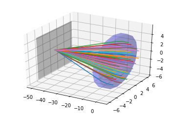

# Optical Ray-Tracer
Year two computing project at Imperial

---

## Project goals (taken verbatim from the assignment)

1. design and write an optical ray tracer in Python using object-oriented programming
2. test and verify the operation of the ray-tracer
3. use the ray-tracer to investigate the imaging performance of simple lenses
4. use the ray-tracer to optimise the design of a biconvex lens

## Project Description

`trace` is a Python module which implements a ray-tracer. The user can assemble a scene,
containing different lenses or mirrors, as well as ray sources (rays may also be added
directly). The module was designed to be easy and safe to use.

To accommodate the need for optimizing parameters of lenses (or other geometry objects),
`trace` offers a optimization package, which allows any numeric parameter of a geometry
object to be changed after it's creation.

To complement the use of `trace` in interactive sessions, a graphics package (using
[matplotlib][plot]) is also provided. It allows the user to visualize scenes and screens
in 3D or 2D.

## Documentation

The code in this project is fully documented with comments and doc-strings. For a walk-through
of `trace`'s features, see the accompanying [`demo_notebook.ipynb`][demo] [Jupyter notebook][jupyter].
This notebook includes examples of how to work with scenes and how to use the optimization
package.

## Unit Tests

A suite of unit tests is available and can be run with `$ python tests.py`.

[plot]: https://matplotlib.org/
[demo]: ./demo_notebook.ipynb
[jupyter]: https://jupyter.org/